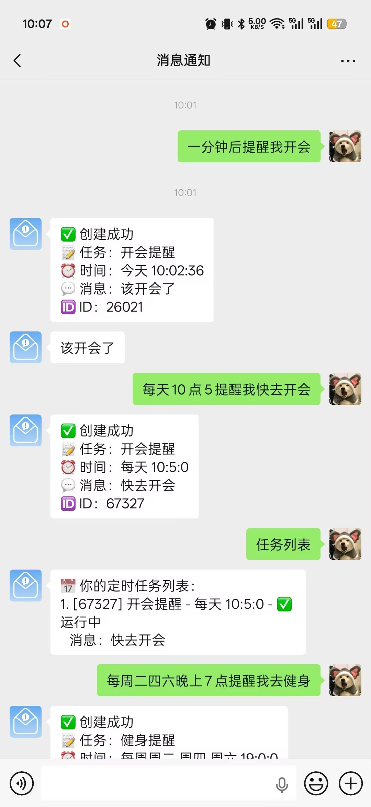
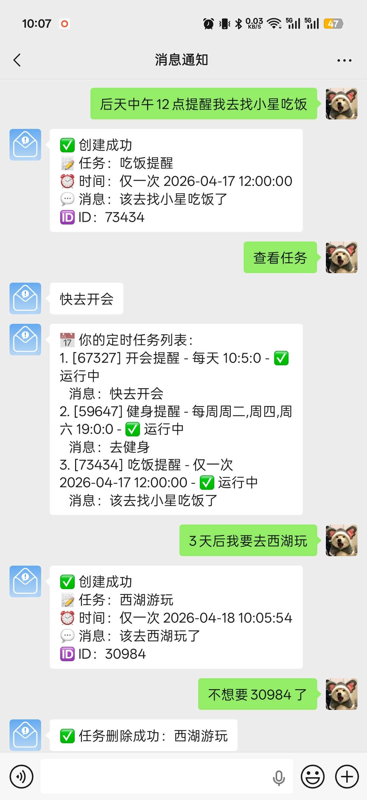
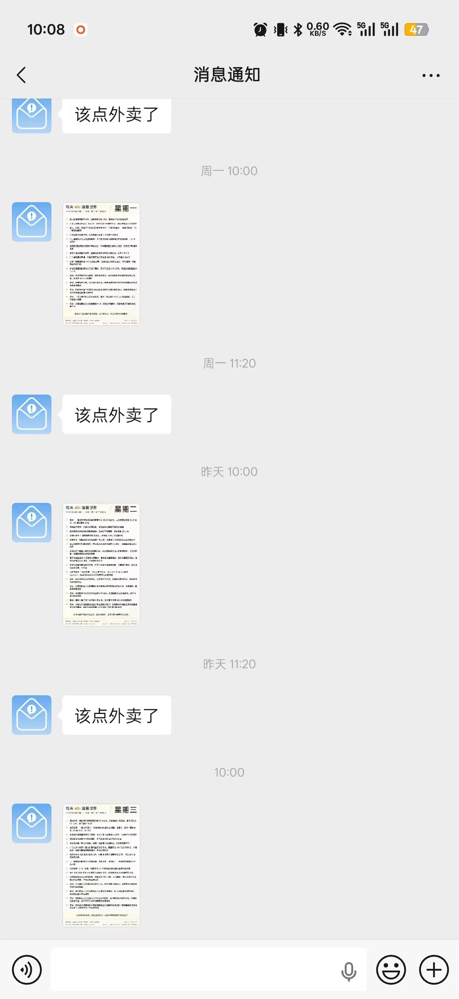

# 企业微信机器人

一个可开源部署的企业微信机器人服务，支持：

- 多应用（多 `agent_id`）消息接入
- 定时任务（创建/查看/修改/删除）
- 企业微信 Webhook 回调处理

> 说明：本项目完成于 2025 年，部分第三方接口、SDK 或平台配置项后续可能变化。如遇到不兼容，请优先参考对应平台最新官方文档调整。  
> 使用声明：使用、修改与分发本项目代码时，请遵守本项目采用的开源协议（LICENSE）。

## 部分功能演示图片

1、定时任务管理

<div style="overflow-x:auto;-webkit-overflow-scrolling:touch;">
  <div style="display:flex;gap:12px;align-items:flex-start;min-width:max-content;padding:6px 2px;">
    
    
    
  </div>
</div>


## 项目详细介绍

本项目基于 `FastAPI` 实现企业微信消息回调服务，核心目标是：  
将「企业微信应用消息能力」和「可扩展的插件/定时任务机制」解耦，便于按业务快速扩展。

你可以把它理解为三层：

- **应用层（agents）**：每个企业微信应用独立配置 `agent_id/secret/token/plugins`。
- **插件层（plugins）**：处理收到的消息并返回回复内容（例如 AI 对话、任务管理）。
- **任务层（tasks）**：通过调度器按时间触发，主动推送消息给企业微信用户。

## 功能概览

### 1) 多应用

- 在 `config.yaml -> wechat.agents` 下可配置多个应用。
- 每个应用可绑定不同插件集合，实现同一服务多机器人分工。

### 2) 插件机制

- 插件放在 `plugins/` 目录，继承 `core/plugin.py` 中的 `Plugin` 基类。
- 框架会自动加载插件，并按应用配置进行启用。
- 当前示例插件：
  - `schedule_manager`：定时任务管理插件（创建/查看/删除/修改任务）
  - `ai_chat_demo`：通用 AI 对话演示插件

### 3) 定时任务

- 任务放在 `tasks/` 目录，通过 `@scheduled_task(...)` 注册。
- 当前示例任务：
  - `demo_task.py`：基础文本定时推送示例
  - `today_60s.py`：每日资讯图片推送示例

### 4) Webhook 回调

- 企业微信消息回调由服务统一处理。
- 回调消息会根据 `agent_id` 分发到对应应用已启用插件。

## 快速开始

1. 复制配置模板：

```bash
cp config.example.yaml config.yaml
```

2. 安装依赖并启动：

```bash
pip install -r requirements.txt
python main.py
```

## Docker 运行

### 构建镜像

```bash
docker build -t wxbot:latest -f Dockerfile .
```

### 启动服务

```bash
docker compose up -d
```

### 停止服务

```bash
docker compose down
```

## 配置说明

- 请使用 `config.example.yaml` 作为模板，填写企业微信应用信息与 Redis 配置。
- 详细字段说明见 [`docs/配置说明.md`](docs/配置说明.md)。
- 其他：[`docs/企业微信应用配置说明.md`](docs/企业微信应用配置说明.md)。

## 开发文档

- 自定义插件与定时任务开发：[`docs/自定义插件.md`](docs/自定义插件.md)
- 插件分享仓库：[`wecom-bot-plugins`](https://github.com/XingHehy/wecom-bot-plugins)
