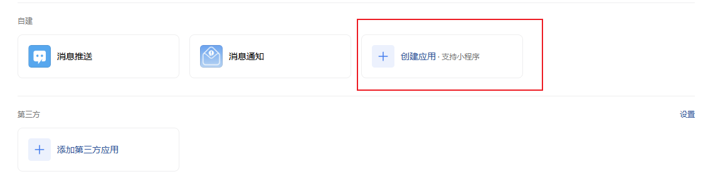
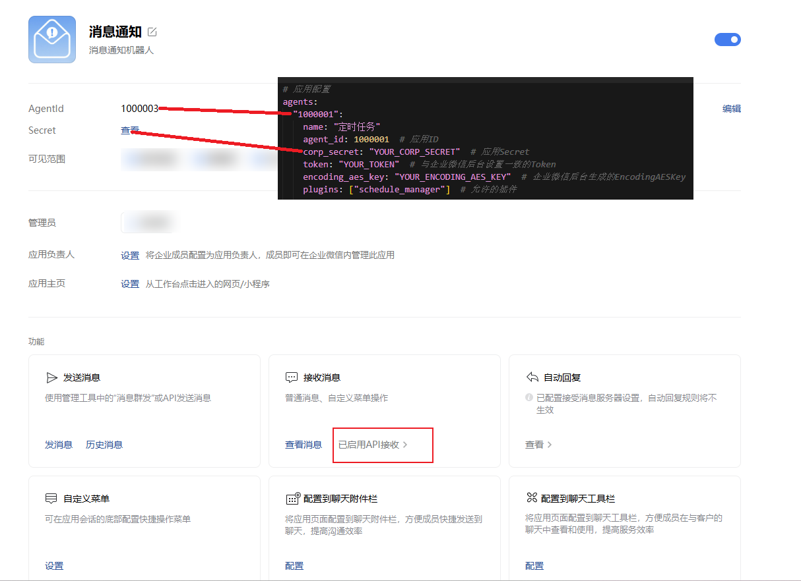
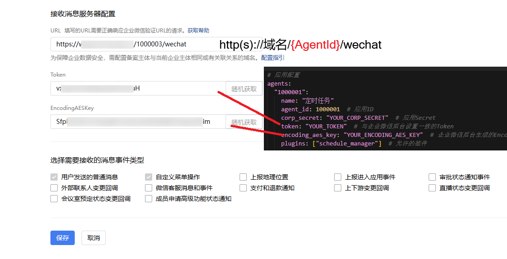
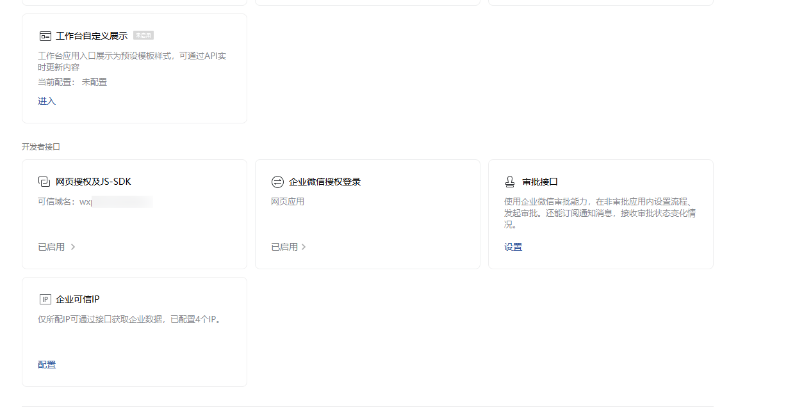

# 企业微信应用配置说明

本文用于指导如何在企业微信后台创建应用，并完成本项目所需的回调与安全配置。

## 一、创建企业微信应用

1. 打开企业微信管理后台应用页面：  
   [https://work.weixin.qq.com/wework_admin/frame#/apps](https://work.weixin.qq.com/wework_admin/frame#/apps)
2. 新增一个自建应用，填写应用名称、可见范围等基础信息。
3. 创建完成后，记录应用的 `AgentId` 和 `Secret`，用于填写 `config.yaml`/`config.example.yaml`。



## 二、设置接收消息 API

### 2.1 设置接收消息 API

在应用管理页中找到「接收消息」配置项，开启并进入设置页面。

需要准备以下参数（与项目配置对应）：

- `Token`
- `EncodingAESKey`
- 回调 URL（示例：`https://your-domain.com/{agent_id}/callback`，按你的实际路由为准）



### 2.2 接收消息服务器配置

在「接收消息服务器配置」中填写：

- URL：你的服务公网地址（必须可被企业微信访问）
- Token：与 `config` 中对应应用 `token` 保持一致
- EncodingAESKey：与 `config` 中对应应用 `encoding_aes_key` 保持一致

保存后执行「验证」并确保通过。



## 三、网页授权、可信域名与可信 IP

### 2.3 网页授权及 JS-SDK OAuth 回调域名 / 可信域名配置，以及企业可信 IP 配置

在应用或企业安全相关设置中完成以下配置：

1. OAuth 回调域名（用于网页授权）
2. JS-SDK 可信域名
3. 企业可信 IP（建议填部署服务器出口 IP）

并与项目配置保持一致：

- `wechat.oauth.callback_domain`
- `wechat.oauth.callback_domains`
- `deployment.domain`



## 四、与项目配置的对应关系

每新增一个企业微信应用，需要在 `config.yaml` 的 `wechat.agents` 下新增一个应用节点，例如：

```yaml
wechat:
  agents:
    "1000001":
      name: "示例应用"
      agent_id: 1000001
      corp_secret: "YOUR_CORP_SECRET"
      token: "YOUR_TOKEN"
      encoding_aes_key: "YOUR_ENCODING_AES_KEY"
      plugins: ["schedule_manager"]
```

完成后重启服务，验证该应用的消息收发是否正常。
